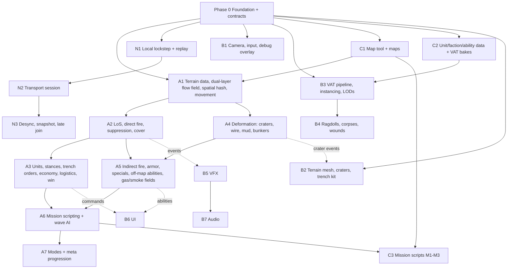

# Phases, dependencies and schedules

> Part of the Trench Warfare 3D roadmap. See [README](../README.md) for the index.
>
> **Re-cut 2026-09-20:** milestones below were revised in [11-plan-review](11-plan-review.md) §5 — a P0.5 baseline step, a new **M1.5 fun gate** before
> any presentation investment, A5 split into A5a/b/c, and Online (N2/N3) moved after Mission 3. The systems catalog is unchanged.

## Systems catalog by phase

### Phase 0 — Foundation (both people; blocks everything)
| Item | Detail |
|---|---|
| Project | New Unity 6 LTS project, packages, `.gitignore`, folder layout, asmdefs (see [04-architecture](04-architecture.md)) |
| `SimWorld` | Slot arrays: `pos, vel, yaw, hp, suppression, stance, team, archetype, trenchId, layer, targetSlot, cooldowns, flags`; free-list; `Step()` runs systems in fixed order |
| `SimConfig` | Tick rate, input delay, grid sizes, tuning constants (ScriptableObject → blob) |
| `SimRandom`, `SimHash` (FNV-1a 64 over arrays), `SimMath` (polynomial transcendentals under Burst Strict) |
| `SimEvents` | Ring buffer, per-tick begin/end indices |
| `ReplayRecorder/Player` | Seed + map id + command stream + per-tick hashes, file format v1 |
| `MapData` + `GreyboxMapGenerator` | Flat corridor, one trench line per side, links, spawn points |
| `SimPresenter` | Interpolates poses between tick N-1 and N; exposes `UnitPose[]` |
| `BootstrapSceneBuilder` (editor menu) | Generates `Bootstrap.unity`, `GreyboxCorridor.unity` |
| Tests | Determinism replay (same seed twice → identical hashes), cross-platform hash compare |

### Track A — Simulation
**A1 Terrain data, navigation, movement (L)**
- Heightfield load; nav cost field from layers (Surface 1, Mud 4, Wire 40 until breached, Blocked 255).
- Dual-layer flow field: each `(goalSet, layer)` has its own integration field; `Link` cells connect layers
  with vault/ladder cost; trench cells only reachable via links or trench continuity.
- Flow field manager: one field per **goal group** (per team: next objective forward, fallback trench,
  rally point); recomputed only when cost field or goal changes; Dijkstra wavefront in a Burst job,
  time-sliced across ticks with double buffering.
- Spatial hash rebuild per tick; separation impulse `k·(2r−d)·n`; max speed by stance × terrain (mud 0.5×).
- "Over the top": unit at a `Link` cell with an Advance order switches `layer=Surface`, plays vault, gets
  `Exposed` flag for suppression/hit calc.
- Movement integrator with yaw smoothing; vehicles use a separate kinematic model (turn radius, trench-crossing rule: Mark IV/A7V cross trench cells ≤ 3.5 m wide, cars cannot).

**A2 Line of sight, direct fire, suppression, cover (L)**
- `HeightfieldRaycast`: Amanatides-Woo through 1 m cells, compare ray height vs cell height + eye/target offsets
  by stance (prone 0.4 m, crouch 1.0 m, standing 1.6 m, fire-step = parapet 1.5 m). Smoke field concentration
  along the ray reduces visibility.
- Target acquisition: nearest visible enemy in weapon range within a 3-tick staggered scan (⅓ of units per tick).
- Direct fire: hit chance = base accuracy × range falloff × target stance modifier × cover modifier
  (cover from `CoverVolume`s: trench parapet, crater rim, sandbags, tank hull; **directional**: cover applies
  only if attacker bearing is within the volume's protected arc — this is the enfilade mechanic).
- Near-miss: shots that miss by < 1.5 m add suppression to targets in that cell (spatial hash query).
- Suppression meter 0–100, decays 8/s; > 60 → forced Prone, > 85 → Pinned (refuses Advance, auto-Fallback
  if in the open and a trench is within 20 m). Officer aura and smoke halve gain; MG fire triple gain.
- Trench garrison: entering `Trench` cell → auto crouch below rim; when firing → snap to fire-step (`animRow`
  peek) and expose head only (cover 85 %); under suppression > 40 → stay below rim, no fire.

**A3 Units, orders, economy, logistics, win condition (L)**
- Five-slot roster from `FactionDefinition`; per-unit stats from `UnitDefinition` blobs.
- Stances: Prone (0.6× speed, +cover, −accuracy for MG? no: MG +accuracy prone), Crouch (default in trench),
  Sprint (Advance order, 1.5× speed, no fire, +suppression gain).
- Trench commands (>> / roster / lock / fallback) exactly as 2D, mapped onto per-trench unit lists.
- Silver economy: +1/s base (tunable per mission), unit costs from data, deployment queue with spawn cadence.
- Staged logistics: reinforcements walk the **supply road** (Z from map edge to rally point) or emerge from
  the **communication trench** (safer, slower). `SetRally` moves the collection point.
- Sector control win: objectives are captured by holding ≥ N friendly infantry in the objective cells for
  T s with no enemies inside. Order forced: OutpostLine → MainLine → ReserveLine → HQ dugout. Capturing the HQ
  wins; losing your own HQ loses. Trench traverse capture = each traverse segment flips individually (grenade
  "room clearing" along the zigzag).

**A4 Terrain deformation and obstacles (M)**
- `CraterStamp(pos, radius, depth)`: carve heightfield (cosine bowl), mark `Crater` layer, spawn `CoverVolume`
  (rim height, full 360° arc but low), recompute local cost field, queue dirty terrain chunks (event).
- Wire belts: `Wire` layer cost 40, infantry crossing speed 0.2×; breached (cost reset) by Bangalore, HE
  ≥ 105 mm, or vehicles (crush on contact). Wire funnels flow-field paths into gaps = kill zones.
- Mud: speed 0.5×, vehicles roll a per-tick bog check (`p = mudFactor × weightClass`), bogged = stalled T s.
- Bunkers: `Blocked` cells with an embrasure `CoverVolume` (frontal 95 %, flanks 40 %, rear 0 %).

**A5 Indirect fire, armor, specials, off-map abilities (L)**
- Indirect: solve launch angle for range with fixed v0 (high arc for mortars, low arc for howitzers), sample
  the parabola against heightfield only for terminal impact; trench cells receive full blast (open top),
  bunkers 0.
- Blast: radius falloff damage via spatial hash, suppression pulse, `CraterStamp` if calibre ≥ 75 mm.
- Armor: `ArmorProfile{front, side, rear, top}` mm; penetration = `pen(weapon) × cos(incidence)` vs plate;
  fail → ricochet event, 0 damage; success → damage + module roll (track 20 %, engine 10 %, crew 5 %).
  Track hit → immobilised T s; engine stall → stopped, repairable if not under fire 10 s.
- Specials, grenades, abilities: see [07-abilities](07-abilities.md).
- Off-map abilities: see [07-abilities](07-abilities.md); each has cost, cooldown, warm-up (spotting round delay), and event emission.

**A6 Mission scripting and AI (M)**
- `MissionScript` blob: ordered list of `Trigger{condition, actions}`; conditions: tick ≥, wave N started,
  objective captured/lost, unit count in volume, silver ≥, timer; actions: spawn wave (composition, entry point,
  order), enable/disable player slot or ability, set enemy ability budget, play dialogue id (event), set
  win/lose rule, weather/fog change.
- Wave AI: deploys from budget with weighted composition, uses trench orders (garrison until strength ≥ X or
  timer, then `TrenchAdvance`), calls off-map abilities on the densest player cell (spatial hash heat query),
  counterattacks a just-lost objective after T s.
- Difficulty tiers (Normal/Hard/Finale) scale budget, wave interval and ability cooldowns.

**A7 Modes and meta (M, post-slice)**
- Survival (50 waves, static income), Operations (20 sectors, deferred payout), Sandbox editor hooks.
- Gold economy, six-tier upgrades (+5 HP/DMG/ACC, costs 15/20/40/60/80/100), Growth Fund track, uniform skins
  (presentation-only data).

### Track N — Networking
| Step | Content | Size | Needs |
|---|---|---|---|
| N1 | `LockstepDriver`: command frames per tick, input delay, `LoopbackTransport` with simulated latency/jitter/loss; replay file | M | P0 |
| N2 | `com.unity.transport` session, lobby handshake (seed, map, factions, difficulty), clock sync, stall handling | M | N1 |
| N3 | Per-tick hash exchange, desync detection + both-side state dump, snapshot serialization for late join/reconnect, spectator replay | M | N2 |

### Track B — Presentation
| Step | Content | Size | Needs |
|---|---|---|---|
| B1 | Tactical camera (pan/zoom/limited rotate, edge scroll), Input System actions, **debug overlay** (nav layers, flow vectors, LoS rays, cover arcs, spatial hash, suppression bars, objective state, flow-field goal ids). First, it is Track A's debugging tool | S | P0 |
| B2 | Chunked terrain mesh (32 m chunks) from heightfield; dirty-chunk upload; GPU vertex displacement; trench geometry kit (parapet, fire-step, duckboards, revetment) instanced along `TrenchDef` splines; wire/mud/crater decals; PBR mud/grey palette | M | P0, A4 (integration) |
| B3 | Editor VAT baker (RGBAHalf atlas per archetype: idle, walk, sprint, crouch-walk, prone-crawl, fire-standing, fire-fire-step, fire-prone, throw, vault, flinch ×3, death ×4, pinned-loop), URP VAT shader (2-frame lerp near, nearest far), `RenderMeshIndirect` from job buffer, 4 LOD tiers + 8-direction impostors, hero skeletal pool (10–20) | L | P0, C2 |
| B4 | Pooled PhysX ragdolls (cap 15) aligned from VAT frame, sleep → bake to static instanced corpse; ellipsoid-clip wounds with embedded gore geometry; corpse density cap with oldest-first fade | M | B3 |
| B5 | VFX: rifle/MG tracers, impacts by material, HE/mortar bursts, crater dust, gas volumetric fog volumes coloured by agent, smoke screens, bomber flyover, muzzle flashes, tank exhaust; all from `SimEvent` (prototype on a recorded stream) | M | P0, A2/A5 (integration) |
| B6 | UI: five deploy slots with cost/cooldown, silver HUD, trench widgets (`>>`, roster `↑` with class toggles, lock, `↩`), ability bar with cooldown + target reticle (line/area/heading), objective tracker, wave banner, suppression/pinned icons, mission dialogue strip, pause/replay controls | M | P0, A3/A5 (integration) |
| B7 | Audio: event-driven pooled sources, distance/occlusion by heightfield, barrage rumble, gas hiss; music stingers on triggers | S | B5 |

### Track C — Content and tools
| Step | Content | Size | Needs |
|---|---|---|---|
| C1 | Map authoring (editor window): paint heightfield, trench splines → cells + links + fire-steps, wire belts, mud, bunkers, objectives, spawn/supply road, trigger volumes; export `MapData`; greybox first, then three mission maps ([08-missions](08-missions.md)) | M | P0 |
| C2 | `UnitDefinition`/`WeaponDefinition`/`VehicleDefinition`/`AbilityDefinition`/`FactionDefinition` ScriptableObjects → blobs; British + German rosters complete for the slice, others data-only | M | P0 |
| C3 | Mission scripts for M1–M3 as ScriptableObjects → `MissionScript` blobs; dialogue tables | S | A6, C1 |
| C4 | Placeholder-to-final art passes: infantry meshes per faction/uniform, vehicles, trench kit, props | ongoing | B3 |

## Phase graph, milestones and schedules

### Milestones and acceptance criteria
| Milestone | Composed of | Acceptance |
|---|---|---|
| P0.5 Baseline is true | compile fixes, Entities out, metas + ProjectSettings, `unity test` green, CI | EditMode + PlayMode exit 0 on a fresh clone |
| M1 Greybox corridor | P0, A1, B1, N1, greybox generator | 2,000 capsules flow across the corridor through trench links; two loopback sims with 120 ms fake latency stay hash-identical for 5,000 ticks; sim ≤ 3 ms/tick |
| **M1.5 Fun gate** | A2 core, A3 core, A5a-lite (one HE, one gas), capsules + IMGUI | Playtest: is trench-to-trench assault better in 3D? Decides unit density and B3 scope |
| M2 First firefight | A2, A3, B3, B6 (slots + trench widgets), C2 (Brit/Ger infantry) | Riflemen garrison and fire from fire-step, MG enfilade pins an advancing wave, `>>`/`↩` work; VAT infantry ≤ 3 draw calls per archetype |
| M3 Shells and gas → **Mission 1 playable** | A4, A5 (HE, gas, smoke, sniper, sentry), A6, B2, B5, C3 (M1) | Barrage carves craters, gas sinks into trenches, Mission 1 completable on Normal |
| M4 Combined arms → **Mission 2 playable** | A5 (creeping barrage, field gun, armor, Bangalore, tanks), B4, C1 (Somme) | Mission 2 completable; tank crosses trench, bogs in mud, wire crushed |
| M5 Vertical slice → **Mission 3 playable** | A5c (mines, fascine, AA, flamethrower, A7V), B7, C2 full, C3 (M3), perf pass | Three missions on Normal/Hard, **60 fps on GTX 1050 at 1080p**, sim ≤ 4 ms/tick at 2,000 units, zero GC alloc/frame |
| M6 Online (only if a launch requirement) | N2, N3 | Two clients over a real network, symmetric map, desync detected and dumped, replay playback |
| M7 Modes + meta | A7 | Survival, Operations, campaign shell, upgrades, skins |

### Single-developer order
> Original ordering; apply the re-cut in [11-plan-review](11-plan-review.md) §5 (M1.5 after M1, B3 after M1.5, N2/N3 last).

P0 → B1 → C1 (greybox) → A1 → N1 → **M1** → A2 → A3 → C2 (infantry) → B3 → B6 → **M2** → A4 → B2 →
A5 (HE, gas, smoke, sniper, sentry) → B5 → A6 → C3 (M1) → **M3** → A5 (armor, field gun, creeping, Bangalore) →
B4 → C1 (Somme) → C3 (M2) → **M4** → N2 → N3 → **M5** → A5 (mines, fascine, AA, flamethrower) → B7 →
C1 (Cambrai) → C3 (M3) → perf → **M6** → A7 → **M7**.

### Two-developer schedule (rows concurrent)
| Person A (sim/net) | Person B (presentation/tools/content) |
|---|---|
| P0 sim core, hash, replay, determinism gate | P0 project, packages, asmdefs, scene builder, CI test script |
| A1 | B1, C1 tool + greybox |
| N1 | B3, C2 infantry data + bakes |
| — M1 — | — M1 — |
| A2, A3 | B6, B5 (against recorded events), B2 |
| — M2 — | — M2 — |
| A4, A5 (part 1), A6 | C1 Ypres map, C3 M1 script, B4 |
| — M3 (Mission 1) — | — M3 — |
| A5 (part 2: armor, creeping, field gun) | C1 Somme, C2 vehicles, C3 M2 |
| — M4 (Mission 2) — | — M4 — |
| N2, N3 | B7, C1 Cambrai, C2 full rosters |
| — M5 — | |
| A5 (part 3: mines, fascine, AA, flamethrower), perf | C3 M3, art passes, perf |
| — M6 (Mission 3, slice) — | — M6 — |
| A7 | campaign UI, skins |
