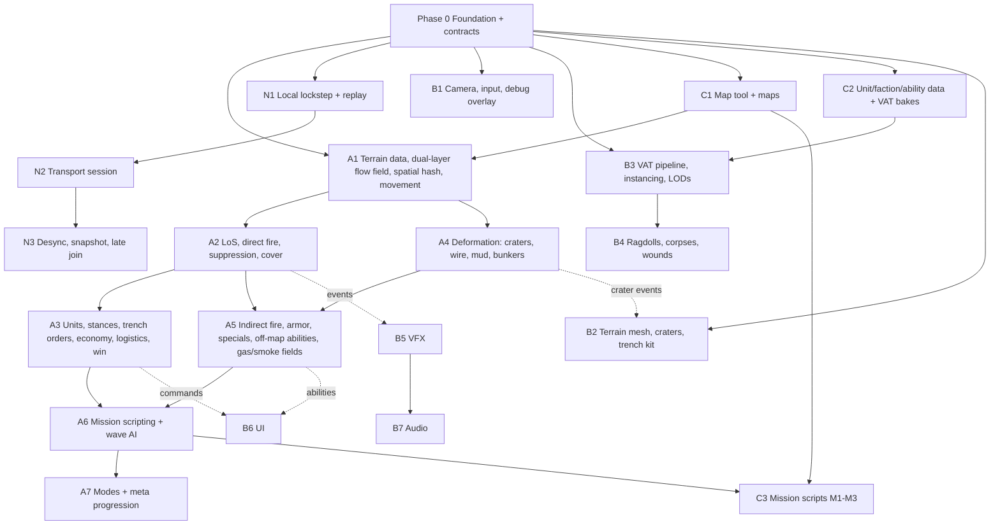

# Trench Warfare 1917 → 3D: Phased Project Plan (exhaustive)

> **Superseded in part on 2026-09-20 — read [11-plan-review.md](11-plan-review.md) first.** Entities/Entities Graphics
> are out (§2.2 below is stale), the sim is float-only with no fixed-point fallback (§2.3), the replay header is v2 (§3),
> milestones are re-cut with a P0.5 baseline step and an M1.5 fun gate, and Online moves after Mission 3 (§11).
> Ship target is Windows x64 only. The unit, ability and mission catalogs (§5–§10) are unchanged.

## 1. Context

Rebuild the lane-based 2D tug-of-war RTS *Trench Warfare 1917* as a 3D tactical title: high-angle isometric
camera, corridor-bound sector (300 m × 800 m), dual-layer trench/surface navigation, real line of sight,
direct + arced ballistics, suppression, deformable terrain, thousands of infantry at 60 fps on entry-level
desktop hardware (GTX 1050 / Iris Xe class).

The repository holds `github-test1/`, a Unity **2021.3.1f1** URP test project (a bridge scene, screen-space
shadow/reflection shaders, Amplify Shader Editor). No game code, nothing reusable. Work is greenfield.

Decisions made by the user:

| Decision | Choice |
|---|---|
| Deliverable of this plan | Roadmap docs **and** a Unity project skeleton (folders, asmdefs, packages, stub/implemented code) so phases can start in parallel |
| Engine | **Unity 6 LTS (6000.0.x)**, Entities 1.3, Burst, Collections, Mathematics, URP 17 |
| Multiplayer | **Deterministic lockstep from the start** |
| Team | **1–2 people** → two parallel tracks max, plus a single-developer ordering |
| Content scope for the plan | **3 missions**, all unit/enemy types, all battlefield abilities |

Assumption (stated, not asked): the 3D game gets a new project folder **`trench-warfare-3d/`** beside
`github-test1/`, which is left untouched (upgrading 1,900 unrelated Amplify/bridge files through 2021→6 has no benefit).

---

## 2. Core architectural decisions

### 2.1 Sim / Presentation split with three frozen contracts
Simulation never references presentation. Presentation reads interpolated snapshots and an event stream.
The three contracts (§3) are frozen in Phase 0; every later phase builds against them independently.

### 2.2 Deterministic sim core = plain Burst Structure-of-Arrays; Entities = presentation world
Authoritative state is a `SimWorld` struct of `NativeArray`/`NativeList` keyed by **stable slot indices**
(free-list, generation counter), stepped by Burst jobs at a fixed tick.
- Hashing/snapshotting (desync detection, late join, replays) is a byte walk over contiguous arrays.
- No `EntityCommandBuffer` ordering subtleties in the sim.
- Entities 1.3 + Entities Graphics run the **presentation world**: one entity mirrors each visible sim slot;
  BatchRendererGroup instancing for non-VAT meshes (vehicles, guns, wire, props). VAT infantry uses
  `Graphics.RenderMeshIndirect` from a job-filled `GraphicsBuffer`.

### 2.3 Determinism coding standard (enforced from Phase 0)
- Fixed **20 Hz** sim tick (`SimConfig.TickRate`); presentation interpolates at display rate.
- `Unity.Mathematics` only; Burst `FloatMode.Strict`, `FloatPrecision.Standard`; no `Mathf`, `Time.*`,
  `UnityEngine.Random`, PhysX, or managed collections in sim. Seeded `Unity.Mathematics.Random` from
  `hash(matchSeed, tick, systemId, slot)`.
- Parallel jobs write only to their own index; reductions are fixed-order.
- Transcendentals via `SimMath` (LUT sin/cos/atan2, integer sqrt option) so cross-platform behaviour is ours.
- **Phase 0 gate:** cross-platform determinism test (Windows x64 / Linux x64 / macOS ARM64). If strict floats
  diverge, switch `SimMath` to Q32.32 fixed-point; the abstraction keeps the swap local.
- Ragdolls/PhysX are cosmetic, presentation-only, never read back into sim.

### 2.4 Lockstep over Unity Transport (custom), not Netcode for Entities
Command frames with 2–3 ticks input delay, per-tick hash exchange, desync dump, deterministic replay files.
Netcode for Entities is prediction-based and unsuited to thousands of units.

### 2.5 Map data model
| Grid | Cell | Format | Purpose |
|---|---|---|---|
| Heightfield | 1 m | `int16` cm | LoS raycast, cover, crater carving, terrain mesh source |
| Nav grid | 2 m | `byte layer` + `byte cost` | Flow fields, layer bits |
| Spatial hash | 1 m (=2·r) | `NativeParallelMultiHashMap<int,int>` | Separation, ballistics candidates, AoE |
| Gas/smoke field | 4 m | `half concentration` ×2 | Gas DoT, smoke LoS occlusion |

Nav layer bits: `Surface`, `Trench`, `Link` (ladder/ramp/parapet vault), `Blocked`, `Wire`, `Mud`, `Crater`,
`Bunker`. Tug-of-war axis is +Z; player A deploys at Z=0, player B at Z=800.

---

## 3. Contracts (frozen in Phase 0)

### 3.1 Command contract
```
struct SimCommand { uint tick; byte player; CommandType type; int a; int b; float3 pos; }
enum CommandType {
  DeployUnit(slot=a),                  // spend silver, queue at spawn point
  TrenchAdvance(trenchId=a),           // ">>"
  TrenchSelectAdvance(trenchId=a, unitMask=b), // roster "↑" partial advance
  TrenchLock(trenchId=a, on=b),        // lock icon
  TrenchFallback(trenchId=a),          // "↩"
  UnitStance(unitSlot=a, stance=b),    // 3D addition: prone/crouch/sprint override
  SupportFire(abilityId=a, pos, b=heading), // HE, gas, bomber, smoke, creeping barrage
  UnitAbility(unitSlot=a, abilityId=b, pos), // officer smoke call, bangalore, etc.
  SetRally(pos),                       // logistics: where reinforcements collect
  Surrender
}
SimWorld.Step(NativeSlice<SimCommand> cmdsForThisTick)
```
Commands are validated in-sim (cost, cooldown, ownership); invalid ones are dropped deterministically.

### 3.2 Map data contract
`MapData` blob: dims, cell sizes, heightfield, nav layers/cost, trench definitions (`TrenchDef`: id, side,
ordered traverse cells, fire-step cells, links), spawn points, supply road polyline, sector objectives
(`ObjectiveDef`: id, type OutpostLine/MainLine/ReserveLine/HQ, cells, owner), wire belts, mud polygons,
static emplacements, scripted trigger volumes.

### 3.3 Pose + Event stream contract
```
struct UnitPose { float3 pos; half yaw; ushort animRow; half animT; byte archetype; byte flags; byte lod; byte team; }
enum SimEventType { Shot, Hit, NearMiss, Explosion, CraterStamp, Death, StanceChanged, Suppressed, Pinned,
  UnitSpawned, UnitEnteredTrench, UnitLeftTrench, TrenchCaptured, ObjectiveCaptured, GasCloudSpawned,
  SmokeSpawned, VehicleTrackHit, VehicleStalled, VehicleDestroyed, WireBreached, AbilityFired, WaveStarted,
  MissionTriggerFired }
struct SimEvent { uint tick; SimEventType type; int a; int b; float3 pos; float3 dir; float scalar; }
```
Presentation consumes the ring buffer once per frame; audio, VFX, UI, ragdolls and mission dialogue all hang
off it. Mission scripting runs **inside** sim (deterministic) and emits `MissionTriggerFired`.

---

## 4. Systems catalog by phase

### Phase 0 — Foundation (both people; blocks everything)
| Item | Detail |
|---|---|
| Project | New Unity 6 LTS project, packages, `.gitignore`, folder layout, asmdefs (§12) |
| `SimWorld` | Slot arrays: `pos, vel, yaw, hp, suppression, stance, team, archetype, trenchId, layer, targetSlot, cooldowns, flags`; free-list; `Step()` runs systems in fixed order |
| `SimConfig` | Tick rate, input delay, grid sizes, tuning constants (ScriptableObject → blob) |
| `SimRandom`, `SimHash` (xxHash64 over arrays), `SimMath` (LUT transcendentals) |
| `SimEvents` | Ring buffer, per-tick begin/end indices |
| `ReplayRecorder/Player` | Seed + map id + command stream + per-tick hashes, file format v1 |
| `MapData` + `GreyboxMapGenerator` | Flat corridor, one trench line per side, links, spawn points |
| `SimPresenter` | Interpolates poses between tick N-1 and N; exposes `UnitPose[]` |
| `BootstrapSceneBuilder` (editor menu) | Generates `Bootstrap.unity`, `GreyboxCorridor.unity` |
| Tests | Determinism replay (same seed twice → identical hashes), cross-platform hash compare |

### Track A — Simulation
**A1 Terrain data, navigation, movement (L)**
- Heightfield load; nav cost field from layers (Surface 1, Mud 4, Wire 40 until breached, Blocked 255).
- Dual-layer flow field: each `(goalSet, layer)` has its own integration field; `Link` cells connect layers
  with vault/ladder cost; trench cells only reachable via links or trench continuity.
- Flow field manager: one field per **goal group** (per team: next objective forward, fallback trench,
  rally point); recomputed only when cost field or goal changes; Dijkstra wavefront in a Burst job,
  time-sliced across ticks with double buffering.
- Spatial hash rebuild per tick; separation impulse `k·(2r−d)·n`; max speed by stance × terrain (mud 0.5×).
- "Over the top": unit at a `Link` cell with an Advance order switches `layer=Surface`, plays vault, gets
  `Exposed` flag for suppression/hit calc.
- Movement integrator with yaw smoothing; vehicles use a separate kinematic model (turn radius, trench-crossing rule: Mark IV/A7V cross trench cells ≤ 3.5 m wide, cars cannot).

**A2 Line of sight, direct fire, suppression, cover (L)**
- `HeightfieldRaycast`: Amanatides-Woo through 1 m cells, compare ray height vs cell height + eye/target offsets
  by stance (prone 0.4 m, crouch 1.0 m, standing 1.6 m, fire-step = parapet 1.5 m). Smoke field concentration
  along the ray reduces visibility.
- Target acquisition: nearest visible enemy in weapon range within a 3-tick staggered scan (⅓ of units per tick).
- Direct fire: hit chance = base accuracy × range falloff × target stance modifier × cover modifier
  (cover from `CoverVolume`s: trench parapet, crater rim, sandbags, tank hull; **directional**: cover applies
  only if attacker bearing is within the volume's protected arc — this is the enfilade mechanic).
- Near-miss: shots that miss by < 1.5 m add suppression to targets in that cell (spatial hash query).
- Suppression meter 0–100, decays 8/s; > 60 → forced Prone, > 85 → Pinned (refuses Advance, auto-Fallback
  if in the open and a trench is within 20 m). Officer aura and smoke halve gain; MG fire triple gain.
- Trench garrison: entering `Trench` cell → auto crouch below rim; when firing → snap to fire-step (`animRow`
  peek) and expose head only (cover 85 %); under suppression > 40 → stay below rim, no fire.

**A3 Units, orders, economy, logistics, win condition (L)**
- Five-slot roster from `FactionDefinition`; per-unit stats from `UnitDefinition` blobs.
- Stances: Prone (0.6× speed, +cover, −accuracy for MG? no: MG +accuracy prone), Crouch (default in trench),
  Sprint (Advance order, 1.5× speed, no fire, +suppression gain).
- Trench commands (>> / roster / lock / fallback) exactly as 2D, mapped onto per-trench unit lists.
- Silver economy: +1/s base (tunable per mission), unit costs from data, deployment queue with spawn cadence.
- Staged logistics: reinforcements walk the **supply road** (Z from map edge to rally point) or emerge from
  the **communication trench** (safer, slower). `SetRally` moves the collection point.
- Sector control win: objectives are captured by holding ≥ N friendly infantry in the objective cells for
  T s with no enemies inside. Order forced: OutpostLine → MainLine → ReserveLine → HQ dugout. Capturing the HQ
  wins; losing your own HQ loses. Trench traverse capture = each traverse segment flips individually (grenade
  "room clearing" along the zigzag).

**A4 Terrain deformation and obstacles (M)**
- `CraterStamp(pos, radius, depth)`: carve heightfield (cosine bowl), mark `Crater` layer, spawn `CoverVolume`
  (rim height, full 360° arc but low), recompute local cost field, queue dirty terrain chunks (event).
- Wire belts: `Wire` layer cost 40, infantry crossing speed 0.2×; breached (cost reset) by Bangalore, HE
  ≥ 105 mm, or vehicles (crush on contact). Wire funnels flow-field paths into gaps = kill zones.
- Mud: speed 0.5×, vehicles roll a per-tick bog check (`p = mudFactor × weightClass`), bogged = stalled T s.
- Bunkers: `Blocked` cells with an embrasure `CoverVolume` (frontal 95 %, flanks 40 %, rear 0 %).

**A5 Indirect fire, armor, specials, off-map abilities (L)**
- Indirect: solve launch angle for range with fixed v0 (high arc for mortars, low arc for howitzers), sample
  the parabola against heightfield only for terminal impact; trench cells receive full blast (open top),
  bunkers 0.
- Blast: radius falloff damage via spatial hash, suppression pulse, `CraterStamp` if calibre ≥ 75 mm.
- Armor: `ArmorProfile{front, side, rear, top}` mm; penetration = `pen(weapon) × cos(incidence)` vs plate;
  fail → ricochet event, 0 damage; success → damage + module roll (track 20 %, engine 10 %, crew 5 %).
  Track hit → immobilised T s; engine stall → stopped, repairable if not under fire 10 s.
- Specials, grenades, abilities: §8 and §9.
- Off-map abilities: §9; each has cost, cooldown, warm-up (spotting round delay), and event emission.

**A6 Mission scripting and AI (M)**
- `MissionScript` blob: ordered list of `Trigger{condition, actions}`; conditions: tick ≥, wave N started,
  objective captured/lost, unit count in volume, silver ≥, timer; actions: spawn wave (composition, entry point,
  order), enable/disable player slot or ability, set enemy ability budget, play dialogue id (event), set
  win/lose rule, weather/fog change.
- Wave AI: deploys from budget with weighted composition, uses trench orders (garrison until strength ≥ X or
  timer, then `TrenchAdvance`), calls off-map abilities on the densest player cell (spatial hash heat query),
  counterattacks a just-lost objective after T s.
- Difficulty tiers (Normal/Hard/Finale) scale budget, wave interval and ability cooldowns.

**A7 Modes and meta (M, post-slice)**
- Survival (50 waves, static income), Operations (20 sectors, deferred payout), Sandbox editor hooks.
- Gold economy, six-tier upgrades (+5 HP/DMG/ACC, costs 15/20/40/60/80/100), Growth Fund track, uniform skins
  (presentation-only data).

### Track N — Networking
| Step | Content | Size | Needs |
|---|---|---|---|
| N1 | `LockstepDriver`: command frames per tick, input delay, `LoopbackTransport` with simulated latency/jitter/loss; replay file | M | P0 |
| N2 | `com.unity.transport` session, lobby handshake (seed, map, factions, difficulty), clock sync, stall handling | M | N1 |
| N3 | Per-tick hash exchange, desync detection + both-side state dump, snapshot serialization for late join/reconnect, spectator replay | M | N2 |

### Track B — Presentation
| Step | Content | Size | Needs |
|---|---|---|---|
| B1 | Tactical camera (pan/zoom/limited rotate, edge scroll), Input System actions, **debug overlay** (nav layers, flow vectors, LoS rays, cover arcs, spatial hash, suppression bars, objective state, flow-field goal ids). First, it is Track A's debugging tool | S | P0 |
| B2 | Chunked terrain mesh (32 m chunks) from heightfield; dirty-chunk upload; GPU vertex displacement; trench geometry kit (parapet, fire-step, duckboards, revetment) instanced along `TrenchDef` splines; wire/mud/crater decals; PBR mud/grey palette | M | P0, A4 (integration) |
| B3 | Editor VAT baker (RGBAHalf atlas per archetype: idle, walk, sprint, crouch-walk, prone-crawl, fire-standing, fire-fire-step, fire-prone, throw, vault, flinch ×3, death ×4, pinned-loop), URP VAT shader (2-frame lerp near, nearest far), `RenderMeshIndirect` from job buffer, 4 LOD tiers + 8-direction impostors, hero skeletal pool (10–20) | L | P0, C2 |
| B4 | Pooled PhysX ragdolls (cap 15) aligned from VAT frame, sleep → bake to static instanced corpse; ellipsoid-clip wounds with embedded gore geometry; corpse density cap with oldest-first fade | M | B3 |
| B5 | VFX: rifle/MG tracers, impacts by material, HE/mortar bursts, crater dust, gas volumetric fog volumes coloured by agent, smoke screens, bomber flyover, muzzle flashes, tank exhaust; all from `SimEvent` (prototype on a recorded stream) | M | P0, A2/A5 (integration) |
| B6 | UI: five deploy slots with cost/cooldown, silver HUD, trench widgets (`>>`, roster `↑` with class toggles, lock, `↩`), ability bar with cooldown + target reticle (line/area/heading), objective tracker, wave banner, suppression/pinned icons, mission dialogue strip, pause/replay controls | M | P0, A3/A5 (integration) |
| B7 | Audio: event-driven pooled sources, distance/occlusion by heightfield, barrage rumble, gas hiss; music stingers on triggers | S | B5 |

### Track C — Content and tools
| Step | Content | Size | Needs |
|---|---|---|---|
| C1 | Map authoring (editor window): paint heightfield, trench splines → cells + links + fire-steps, wire belts, mud, bunkers, objectives, spawn/supply road, trigger volumes; export `MapData`; greybox first, then three mission maps (§10) | M | P0 |
| C2 | `UnitDefinition`/`WeaponDefinition`/`VehicleDefinition`/`AbilityDefinition`/`FactionDefinition` ScriptableObjects → blobs; British + German rosters complete for the slice, others data-only | M | P0 |
| C3 | Mission scripts for M1–M3 as ScriptableObjects → `MissionScript` blobs; dialogue tables | S | A6, C1 |
| C4 | Placeholder-to-final art passes: infantry meshes per faction/uniform, vehicles, trench kit, props | ongoing | B3 |

---

## 5. Unit catalog (all classes)

Stats are baseline data (2D remake values scaled: cost in silver, HP, damage per shot, range m, RoF/s, speed m/s).
All are `UnitDefinition` fields and will be tuned; 3D columns are new behaviours.

### 5.1 Standard infantry (every faction)
| Class | Cost | HP | DMG | Range | RoF | Speed | 3D behaviours |
|---|---|---|---|---|---|---|---|
| Rifleman | 25 | 100 | 25 | 60 | 0.8 | 3.0 | Fire-step firing; prone in open when suppressed; captures objectives |
| Assault | 40 | 90 | 12 (×burst 5) | 25 | 4 | 4.2 | Sprint vault; auto grenade at ≤ 20 m onto trench cells (arc, ignores LoS); traverse clearing bonus |
| Machinegunner | 60 | 110 | 18 | 80 | 8 (belt 50, reload 4 s) | 2.2 | Kneel/prone deploy time 1.5 s; enfilade arc 60° sweep; triple suppression gain; cannot fire while moving |

### 5.2 Special units (slot 4, faction-specific)
| Special | Factions (default) | Cost | HP | DMG | Range | 3D behaviours |
|---|---|---|---|---|---|---|
| Sniper | British, German, Russian | 90 | 80 | 150 | 80 (+40 % in trench) | Target priority MG > Officer > Sentry; +100 % HP/+25 % acc in trench; reveals from 2 m eye height on fire-step |
| Sentry (armoured MG) | German, Austro-Hungarian | 125 | 300 (plate: front 8 mm) | 18 | 60 | Advances in open under rifle fire (rifle pen 4 mm fails frontally, flanks 2 mm succeed → flanking matters); acts as mobile `CoverVolume` for units behind |
| Mortar team | Russian, Ottoman, French (crapouillot) | 100 | 90 | 120 blast r 6 m | 30–150 | Indirect arc, 6 s cycle, needs stationary 2 s setup; ignores LoS; cannot fire < 30 m |
| Arditi (mobile mortar) | Italian | 110 | 110 | 90 blast r 5 m | 25–100 | Fires while stationary between sprints; grenades too |
| Anti-tank rifle | German, British (later) | 100 | 90 | 1400 pen 20 mm | 70 | Prone-only fire; 5 s cycle; module roll on vehicles |
| Field gun (crew) | French (75 mm), German (7.7 cm), Italian | 125 | 200 | 1500 blast r 4 m, pen 30 mm | 100 | Direct fire only, towed at 1.5 m/s, 4-crew; crater on miss if ≥ 75 mm |
| Shield grenadier | Italian (Farina), French | 80 | 140 (shield front 6 mm) | 12 + grenade | 20 | Frontal shield `CoverVolume` for self and one follower; grenades on trench cells |
| Officer | American, Japanese, British | 110 | 100 | 20 (pistol) | 30 | Aura r 15 m: +15 % DMG, halves suppression gain, cancels Pinned; active: smoke marker → off-map mortar salvo (§9) |
| Flamethrower | German (Flammenwerfer), later others | 120 | 100 | 40/s cone 12 m | 12 | Ignores cover in trench cells (open top), sets `Burning` on cells (DoT 5 s), fuel 10 s, explodes on death |
| Cavalry / Camel cavalry | Russian, Ottoman, Arab | 70 | 120 | 25 | 40 | 8 m/s on surface only; cannot enter trench; wire stops them; dismount at objective |
| Women's Death Battalion (elite rifle) | Russian | 45 | 120 | 30 | 60 | Immune to Pinned (still Prone); morale aura small |

### 5.3 Vehicles (slot 5)
| Vehicle | Faction | Cost | HP | Armor F/S/R/T mm | Weapons | Speed | 3D behaviours |
|---|---|---|---|---|---|---|---|
| Mark IV (Male) | British | 350 | 10 000 | 12/8/6/6 | 2× 6-pdr sponsons (side arcs), 3× Lewis | 1.6 | Crosses trenches ≤ 3.5 m, crushes wire, mobile cover, bog chance high |
| Mark IV (Female) | British | 300 | 10 000 | 12/8/6/6 | 5× Vickers | 1.6 | Anti-infantry variant |
| A7V | German | 400 | 12 000 | 30/20/20/6 | 57 mm front, 6× MG08 | 1.8 | Cannot cross trenches > 2 m (must use ramps), very high bog chance |
| Saint-Chamond | French | 400 | 15 000 | 17/17/17/5 | 75 mm front, 4× Hotchkiss | 2.0 | Long overhang: cannot cross craters > 4 m, cannot climb slopes > 20° |
| Schneider CA1 | French | 300 | 8 000 | 11/11/11/5 | 75 mm BS, 2× Hotchkiss | 2.2 | Cheaper, flammable (fuel tanks) |
| Renault FT | American, French | 220 | 5 000 | 16/16/8/8 | 37 mm turret or MG | 3.0 | Turret 360°, cannot cross trenches > 1.8 m |
| Garford-Putilov | Russian | 300 | 6 000 | 6.5 all | 76.2 mm rear, 3× Maxim | 3.5 (road) 1.0 (mud) | Wheeled: road only effectively, reverse-fires main gun |
| Lancia 1ZM | Italian | 200 | 3 500 | 6 all | 2–3× MG | 5.0 | Fast flanker, wire-cutter rails |
| Pierce-Arrow AA lorry | British | 220 | 3 000 | 3 all | 2-pdr pom-pom | 5.0 | Long-range HE against emplacements |
| Motorcycle sidecar MG | German, Italian | 90 | 600 | 0 | 1× MG | 8.0 | Hit-and-run on roads |
| Ehrhardt E-V/4 | German | 250 | 4 000 | 7 all | 3× MG08 | 4.0 | Wheeled, road only |
| Austin armoured car | Russian, British | 220 | 3 500 | 8 all | 2× Maxim turrets | 4.5 | Wheeled |
| Mark V | British (mission 3 unlock) | 380 | 11 000 | 14/12/8/8 | as Mark IV | 2.0 | Better mud handling |

### 5.4 Faction rosters (default five slots)
| Faction | Rifleman | Assault | MG | Special (default / alt) | Vehicle |
|---|---|---|---|---|---|
| British Empire | SMLE Mk III | Trench raider (Webley + Mills bombs, cut-down SMLE) | Lewis | Sniper / Officer / AT rifle (late) | Mark IV / Mark V / Pierce-Arrow |
| German Empire | Gewehr 98 | Sturmtruppen (MP18 + Stielhandgranate) | MG 08/15 | AT rifle / Sentry / Flamethrower / Sniper | A7V / Ehrhardt / motorcycle |
| French Republic | Lebel / Berthier | Nettoyeur (revolver, VB grenades) | Hotchkiss M1914 | 75 mm field gun / Mortar / Shield grenadier | Saint-Chamond / Schneider / FT |
| United States | M1903 | M97 trench gun | BAR | Officer (smoke→mortar) | Renault FT |
| Russian Empire / Red / White | Mosin-Nagant | Assault (incendiary No. 76 grenades → `Burning` cells) | Maxim M1910 | Mortar / Sniper / Death Battalion / Cossack cavalry | Garford-Putilov / Austin |
| Italy | Carcano | Arditi (mortar) | Villar Perosa | Shield grenadier / Field gun | Lancia 1ZM |
| Austria-Hungary | Mannlicher M95 | Sturmtruppen | Schwarzlose | Sentry / Mortar | (armoured car, data only) |
| Ottoman Empire | Mauser 1893 | Assault | Maxim | Camel cavalry / Mortar | (data only) |
| Japan | Type 38 | Assault | Type 3 | Officer (sword aura) | (data only) |
| Bulgaria, Romania, Belgium, Serbia | data-only rosters reusing the above archetypes | | | | |

**Slice scope:** British and German fully implemented (all their specials and vehicles); French vehicles for
M3 enemy variety; every other faction exists as data with shared archetypes and placeholder art.

### 5.5 Static enemy / emplacement types
| Emplacement | Sim representation | Counter |
|---|---|---|
| MG nest (sandbag) | Static MG unit in a `CoverVolume` arc 120°, frontal 80 % | Flank, mortar, sniper, smoke + assault |
| Concrete bunker | `Bunker` cells, embrasure arc 60°, 95 % frontal, immune to small arms and gas-lite | Bomber run, field gun, flamethrower at embrasure, grenades at rear door |
| Wire belt | `Wire` layer cost + speed penalty | HE ≥ 105 mm, Bangalore, tanks |
| Observation post / HQ dugout | Objective structure, spotter grants enemy AI faster ability cooldown while alive | Capture (win condition) |
| Field gun emplacement | Static field gun with `CoverVolume` | Indirect fire, tanks from flank, sniper crew |
| Gas projector battery (Livens) | Scripted enemy ability source | Timer/mission trigger |
| Minefield (M3) | Hidden `Mine` cells: infantry 1 m trigger, vehicles track hit | Recon marker, HE barrage clears |
| Rail gun / off-map artillery | Enemy off-map ability with warm-up event (whistle) | Fallback command |

---

## 6. Trench command system (3D mapping)

| Command | 2D | 3D implementation |
|---|---|---|
| `>>` Advance | All garrisoned units leap and sprint to next trench | Units get goal = next enemy trench flow field; vault via nearest `Link`; stance Sprint; `Exposed` |
| `↑` Roster | Pick classes to move | Roster panel per trench with per-class toggles; `TrenchSelectAdvance` mask |
| Lock | Arrivals pass through | Trench flagged `Locked`: arriving units keep flow field to next objective, no garrison |
| `↩` Fallback | Cancel advance, return | Units in open get goal = source trench fallback field; Sprint; suppression gain halved for 3 s (grace) |
| (new) Hold fire / Peek | — | Toggle `SuppressFire`; units stay below rim (survive barrage, no return fire) |
| (new) Rally point | — | `SetRally` for reinforcement staging behind the line |

---

## 7. Stances and cover model

| Stance | Speed | Hit-box height | Cover bonus in open | Accuracy | Trigger |
|---|---|---|---|---|---|
| Standing | 1.0 | 1.6 | 0 | 1.0 | default surface |
| Crouch | 0.8 | 1.0 | +10 % | 1.0 | in trench below rim; crater rim |
| Fire-step | 0 | 0.5 exposed | +85 % (frontal arc 180°) | 1.25 | firing from trench |
| Prone | 0.4 | 0.4 | +40 % | 0.9 (MG 1.2) | suppression > 60, crater floor, player order |
| Sprint | 1.5 | 1.6 | −10 % | no fire | Advance / Fallback |
| Pinned | 0 | 0.4 | +40 % | no fire | suppression > 85 |

`CoverVolume { float3 center; float radius; float protectedArcCenter; float arcHalfWidth; float bonus; float height; }`
Cover applies only if the attacker's bearing lies within the arc and the shot is direct fire. Indirect fire and
grenades ignore cover (open-top), bunkers excepted.

---

## 8. Unit abilities (automatic and active)

| Ability | Owner | Trigger | Sim effect | Events |
|---|---|---|---|---|
| Hand grenade | Assault, Shield grenadier, Raider | Auto at ≤ 20 m vs trench/crater/bunker-rear cells, 6 s cooldown | Arc to target cell, blast r 4 m, 80 dmg, +40 suppression, ignores cover | Shot(arc), Explosion |
| Incendiary grenade | Russian assault | As above | Blast 40 + `Burning` cells 5 s (10 dmg/s, units flee cell) | Explosion, CellBurning |
| Bangalore torpedo | British/German assault (mission unlock) | Active on `Wire` cells within 10 m | 3 s place, wire breached 6 m wide | WireBreached |
| Wire cutters | Rifleman (passive) | In `Wire` cell for 8 s uncontested | Breach 2 m | WireBreached |
| Officer aura | Officer | Passive r 15 m | +15 % dmg, suppression gain ×0.5, un-Pin | — |
| Officer smoke marker | Officer | Active, target pos ≤ 60 m, 45 s cd | Smoke cell + 4 s later off-map mortar salvo 4× r 5 m | SmokeSpawned, Explosion×4 |
| Sniper priority | Sniper | Passive | Target weighting MG/Officer/Sentry/crew | — |
| Sentry plating | Sentry | Passive | Directional armor: rifle fails frontal | Hit(ricochet) |
| Flamethrower burst | Flamethrower | Auto ≤ 12 m | Cone; `Burning`; bunker embrasure bypass | CellBurning |
| Field gun HE / AP | Field gun | Auto: AP vs vehicles, HE vs infantry/bunkers | Direct, crater on ground impact | Explosion, CraterStamp |
| Mortar | Mortar team, Arditi | Auto 30–150 m on densest enemy cell in LoS-independent range | Indirect arc, plunges into trenches | Shot(arc), Explosion |
| Tank crush | Tanks | Contact | Wire breached, infantry in path 200 dmg | WireBreached, Death |
| Tank mobile cover | Tanks, Sentry | Passive | `CoverVolume` behind hull, arc 180° rear | — |
| Track/engine damage | Vehicles | On penetration | Immobilise / stall, repair when unengaged | VehicleTrackHit, VehicleStalled |
| Dismount | Cavalry | At objective / wire | Convert to rifleman slot | UnitSpawned |

---

## 9. Off-map support abilities (the battlefield "throwables")

All are `AbilityDefinition{cost, cooldown, warmupTicks, targetMode(Point/Line/Area/Heading), radius, length, payload}`.
Enemy AI uses the same definitions with a mission-set budget. Each fires `AbilityFired` (for the audio cue / whistle) then payload events.

| Ability | Cost | CD | Warm-up | Target | Sim effect | Counter-play |
|---|---|---|---|---|---|---|
| HE barrage | 150 | 60 s | 4 s (spotting round) | Area r 25 m | 12 shells over 6 s, each 150 dmg r 8 m, +60 suppression, `CraterStamp` r 3 m; wire breached in radius; light vehicles (< 4 000 HP) flipped (destroyed) on direct hit | `↩` Fallback, hold below rim |
| Creeping barrage (new, M2 unlock) | 250 | 120 s | 6 s | Line + heading | Barrage line advances 10 m every 4 s for 40 s ahead of an Advance; suppression wall; friendly units < 15 m behind line take no damage | Enemy: stay below rim, counter-battery timer |
| Chlorine gas | 120 | 90 s | 3 s | Point + wind | Gas field source 40 concentration, diffuses on 4 m grid with map wind vector, sinks into `Trench`/`Crater` cells (×2 concentration); 6 dmg/s per 10 conc, ignores armor/cover; units without mask flag flee upwind; trenches left intact | Fallback, masks (M1 unlock gives 60 % resist), wind change |
| Mustard gas (M3) | 180 | 120 s | 3 s | Area r 20 m | Persistent 90 s, lower DPS, +30 suppression, blocks capture of cells while conc > 5 | Wait it out, capture around |
| Bomber run ("Trench destroyer") | 200 | 120 s | 5 s (flyover) | Line 60 m + heading | 6 bombs 400 dmg r 6 m, collapses trench cells hit (`Trench`→`Crater`, fire-steps removed, cover 50 %), destroys bunkers (2 hits), MG nests | Move out of line; AA lorry shoots plane (M3) |
| Smoke screen | 60 | 30 s | 2 s | Line 40 m | Smoke field 30 s, LoS ray attenuates 8 %/m through conc > 10; snipers and MGs lose targets; suppression gain ×0.5 for units inside | Wait; enemy blind-fires last known cells |
| Off-map mortar salvo | via Officer | 45 s | 4 s | Point | 4× 120 dmg r 5 m | Move |
| Recon flight (new, M2) | 40 | 60 s | 0 | Line | Reveals enemy unit counts per trench in UI for 20 s; reveals minefields (M3) | — |
| Reinforcement surge (Survival only) | 100 | 90 s | 0 | — | Instantly spawns 1× of each infantry slot at rally | — |

Gas/smoke field: `GasSystem` job diffuses two `half` fields (gas, smoke) with wind advection each tick on
the 4 m grid; sink term into trench/crater cells; concentration read by LoS raycast and damage system.

---

## 10. Mission system and the three missions

### 10.1 Mission framework (A6 + C3)
- `MissionDefinition` SO → blob: map id, player faction + roster overrides, unlocked abilities, starting silver,
  income rate, enemy faction, difficulty tier, `MissionScript` triggers, dialogue table, win/lose rules,
  rewards (gold 25/40/75), optional objectives.
- `MissionRunner` (sim system) evaluates triggers each tick in fixed order; emits `MissionTriggerFired(id)`;
  `WaveStarted(n)`.
- Presentation `MissionDirector` reacts: dialogue strip, camera nudges, objective tracker, banners.
- Campaign shell (A7): mission select → briefing → battle → debrief/rewards → army upgrades.

### 10.2 Mission 1 — "Hold the Salient" (Second Ypres, April 1915) — *defensive tutorial*
| | |
|---|---|
| Player | British Empire. Slots: Rifleman, Trench raider, Lewis MG, Sniper, **no vehicle**. Abilities: HE barrage (unlock at trigger 4), Smoke (unlock at trigger 6) |
| Enemy | German Empire, waves only, abilities: chlorine gas (scripted twice), HE barrage (Hard only) |
| Map (`ypres_salient`) | 300 × 600 m. Player: reserve trench (Z 60), main fire trench with 5 traverses (Z 120), outpost sap (Z 180). No Man's Land 180–420 with 2 wire belts (German side), shell-hole belt. German front trench Z 440, support Z 520, spawn Z 600. Wind default +Z→−Z (toward player) for gas, shifts at trigger 5 |
| Starting silver / income | 120 / +1.2 s |
| Objective | Survive 8 waves and keep the main line (objective `MainLine_A`) ≥ 1 friendly unit at all times; lose if enemy captures `ReserveLine_A`. Optional: lose fewer than 20 riflemen (gold +10) |
| Wave script | W1 (t=20 s) 6 riflemen walk in open → teaches garrison + MG. W2 (t=80 s) 10 riflemen + 2 sturmtruppen → teaches roster/sniper on MG. W3 (t=150 s) gas warning dialogue, chlorine drifts onto outpost sap → teaches `↩` Fallback and "gas sinks into trenches". W4 12 riflemen + 4 sturmtruppen advancing behind gas. W5 wind shifts (trigger), player HE barrage unlocked → teaches barrage on the wire gap. W6 sentry + 8 rifles; smoke unlocked; hint: sniper the sentry flanks. W7 counter: 16 mixed + enemy HE (Hard). W8 finale: 20 mixed + 2 sentries, then relief dialogue |
| Phase dependencies | A1, A2, A3, A5 (gas, HE only), A6, B1–B3, B5 (gas, impacts), B6, C1 map, C2 British/German infantry, C3 script |
| Milestone | Playable at **M3** with placeholder art; final at M6 |

### 10.3 Mission 2 — "Over the Top" (Somme, 1 July 1916) — *assault, wire, craters, creeping barrage*
| | |
|---|---|
| Player | British. Slots: Rifleman, Trench raider (+ Bangalore unlock at trigger 3), Lewis, Sniper → Officer swap allowed at debrief, Mark IV **Female** (unlock trigger 6, one at a time). Abilities: HE barrage, Smoke, Creeping barrage (unlock trigger 2), Recon flight |
| Enemy | German. Static: 4 MG nests, 1 concrete bunker at main line, 3 wire belts, field gun emplacement at reserve. Waves: counterattacks after each objective loss. Abilities: HE barrage every 90 s at densest player cell, gas once (Hard) |
| Map (`somme_montauban`) | 300 × 800 m. Player trench Z 80. No Man's Land Z 100–380 rising 6 m toward the German side (reverse-slope MG enfilade from a low rise at X 220, Z 300). Wire belts at Z 330/360/380 with two gaps (pre-sighted by MGs). German outpost line Z 400 (`OutpostLine_B`), main line Z 520 with bunker (`MainLine_B`), reserve Z 640 with field gun (`ReserveLine_B`), HQ dugout Z 720 (`HQ_B`) |
| Starting silver / income | 300 / +1.5 s |
| Objective | Capture Outpost → Main → Reserve → HQ in order. Lose if own trench captured or 12 min timer (Hard). Optional: capture Main line with creeping barrage active (+10 gold) |
| Script | T1 briefing; T2 at 30 s unlock creeping barrage + tutorial reticle; T3 first unit reaches wire → Bangalore unlock + hint; T4 outpost captured → counterattack wave 12 units after 20 s + enemy HE; T5 bunker LoS dialogue (use smoke/bomber not available → flank rear door with raiders); T6 Main line captured → Mark IV Female unlock, dialogue on mud bogging; T7 reserve field gun fires on tank → hint AT roles reversed (sniper the crew); T8 HQ captured → victory |
| Teaches | `>>` timing under creeping barrage, wire gaps as kill zones, crater hopping (units auto-use craters as cover when Pinned), enfilade from the rise, traverse-by-traverse clearing with grenades, tank as mobile cover |
| Phase dependencies | everything in M1 + A4 (craters, wire, mud), A5 (creeping barrage, field gun, armor), B2 (deformation), B4, C1 map, C2 Mark IV |
| Milestone | **M4** |

### 10.4 Mission 3 — "Iron Dawn" (Cambrai, 20 November 1917) — *combined arms, armour vs armour, full sector control*
| | |
|---|---|
| Player | British. Slots: Rifleman, Raider, Lewis, AT rifle **or** Officer (player choice at briefing), Mark IV Male / Mark V (Mark V unlock trigger 5), Pierce-Arrow AA lorry available via trigger 4. Abilities: HE, Creeping barrage, Smoke, Bomber run, Recon flight, Mustard gas (Hard only, moral choice flavour text) |
| Enemy | German. Static: 2 bunkers, 3 MG nests, 2 field guns, minefield at Z 300–340 (revealed by recon), 3 wire belts, Hindenburg-line double trench with a 4 m anti-tank ditch (Mark IV crosses with fascine ability — trigger 2 unlock, A7V cannot). Waves: counterattacks with sturmtruppen, flamethrowers, sentries; **A7V ×2** at reserve line; enemy abilities: HE, gas, bomber (Hard), AT rifles in waves |
| Map (`cambrai_flesquieres`) | 300 × 800 m, dry ground (mud 0) except the ditch; village ruins at Z 600 (bunker cells + rubble cover volumes); ridge at Z 560 (reverse slope: player tanks silhouetted when cresting → field guns get +acc) |
| Starting silver / income | 400 / +2.0 s |
| Objective | Outpost (`Z 380`) → Main Hindenburg (`Z 480`, ditch at 470) → Village (`Z 600`) → HQ (`Z 720`). Lose if own HQ falls. Optional: destroy both A7Vs (+15 gold), no tank lost (+10) |
| Script | T1 recon flight forced tutorial → minefield revealed; T2 first tank near ditch → fascine unlock (tank drops fascine, ditch cells become `Link`); T3 outpost captured → flamethrower counterwave; T4 bunker at main line blocks → bomber run unlock + AA lorry unlock (enemy bomber on Hard); T5 main line captured → A7V pair advances with sentries; Mark V unlock; T6 village: rubble cover volumes, grenade clearing, mustard gas (Hard) by enemy; T7 HQ captured → finale, campaign chapter reward 75 gold |
| Teaches | Armor incidence angles (flank the A7V), track/engine failure, indirect vs bunkers, mines/recon, AA, full sector control |
| Phase dependencies | all of A1–A6, B1–B7, N not required, C1 map, C2 full British + German + French vehicle set, A5 mines/fascine/AA additions |
| Milestone | **M6 vertical slice** |

Multiplayer uses the same maps in symmetric mode (mirrored trench lines, both HQs) — M5.

---

## 11. Phase graph, milestones, schedules



### Milestones and acceptance criteria
| Milestone | Composed of | Acceptance |
|---|---|---|
| M1 Greybox corridor | P0, A1, B1, N1, C1 (greybox) | 2,000 capsules flow across the corridor through trench links; two loopback sims with 120 ms fake latency stay hash-identical for 5,000 ticks; sim ≤ 3 ms/tick |
| M2 First firefight | A2, A3, B3, B6 (slots + trench widgets), C2 (Brit/Ger infantry) | Riflemen garrison and fire from fire-step, MG enfilade pins an advancing wave, `>>`/`↩` work; VAT infantry ≤ 3 draw calls per archetype |
| M3 Shells and gas → **Mission 1 playable** | A4, A5 (HE, gas, smoke, sniper, sentry), A6, B2, B5, C3 (M1) | Barrage carves craters, gas sinks into trenches, Mission 1 completable on Normal |
| M4 Combined arms → **Mission 2 playable** | A5 (creeping barrage, field gun, armor, Bangalore, tanks), B4, C1 (Somme) | Mission 2 completable; tank crosses trench, bogs in mud, wire crushed |
| M5 Online | N2, N3 | Two clients over a real network, symmetric map, desync detected and dumped, replay playback |
| M6 Vertical slice → **Mission 3 playable** | A5 (mines, fascine, AA, flamethrower, A7V), B7, C2 full, C3 (M3), perf pass | Three missions on Normal/Hard, **60 fps on GTX 1050 at 1080p**, sim ≤ 4 ms/tick at 2,000 units, zero GC alloc/frame |
| M7 Modes + meta | A7 | Survival, Operations, campaign shell, upgrades, skins |

### Single-developer order
P0 → B1 → C1 (greybox) → A1 → N1 → **M1** → A2 → A3 → C2 (infantry) → B3 → B6 → **M2** → A4 → B2 →
A5 (HE, gas, smoke, sniper, sentry) → B5 → A6 → C3 (M1) → **M3** → A5 (armor, field gun, creeping, Bangalore) →
B4 → C1 (Somme) → C3 (M2) → **M4** → N2 → N3 → **M5** → A5 (mines, fascine, AA, flamethrower) → B7 →
C1 (Cambrai) → C3 (M3) → perf → **M6** → A7 → **M7**.

### Two-developer schedule (rows concurrent)
| Person A (sim/net) | Person B (presentation/tools/content) |
|---|---|
| P0 sim core, hash, replay, determinism gate | P0 project, packages, asmdefs, scene builder, CI test script |
| A1 | B1, C1 tool + greybox |
| N1 | B3, C2 infantry data + bakes |
| — M1 — | — M1 — |
| A2, A3 | B6, B5 (against recorded events), B2 |
| — M2 — | — M2 — |
| A4, A5 (part 1), A6 | C1 Ypres map, C3 M1 script, B4 |
| — M3 (Mission 1) — | — M3 — |
| A5 (part 2: armor, creeping, field gun) | C1 Somme, C2 vehicles, C3 M2 |
| — M4 (Mission 2) — | — M4 — |
| N2, N3 | B7, C1 Cambrai, C2 full rosters |
| — M5 — | |
| A5 (part 3: mines, fascine, AA, flamethrower), perf | C3 M3, art passes, perf |
| — M6 (Mission 3, slice) — | — M6 — |
| A7 | campaign UI, skins |

---

## 12. Repository output

### 12.1 Docs (`docs/` at repo root + root `README.md`)
| File | Content |
|---|---|
| `docs/00-overview.md` | Vision, constraints, milestone list, hardware targets |
| `docs/01-phases-and-dependencies.md` | §4, §11 tables, mermaid graph, both schedules, acceptance criteria |
| `docs/02-contracts.md` | §3 with full struct layouts, command validation rules, event semantics |
| `docs/03-determinism-rules.md` | §2.3 standard, review checklist, platform gate result log |
| `docs/04-architecture.md` | Assembly map, sim system order, lockstep flow diagram, render tiers, gas/smoke fields |
| `docs/05-performance-budgets.md` | Per-system ms budgets, draw-call/VRAM targets, anti-pattern table, profiling procedure |
| `docs/06-units-and-factions.md` | §5, §7 |
| `docs/07-abilities.md` | §8, §9 |
| `docs/08-missions.md` | §10 incl. map layout ASCII diagrams and trigger tables |
| `docs/09-game-modes-and-meta.md` | Campaign, Survival, Operations, Sandbox, gold/upgrades/Growth Fund/skins |
| `docs/10-risks.md` | §14 |

### 12.2 Unity skeleton (`trench-warfare-3d/`)
```
trench-warfare-3d/
  ProjectSettings/ProjectVersion.txt      (6000.0.x LTS)
  Packages/manifest.json                  (URP 17, entities 1.3, entities.graphics 1.3, burst 1.8,
                                           collections 2.5, mathematics 1.3, transport 2.x, inputsystem 1.x,
                                           test-framework 1.4, ugui; pins verified at execution time)
  .gitignore
  Assets/_Project/
    Sim/Core/       TW.Sim.Core.asmdef      SimWorld, SimConfig, SimCommand, SimRandom, SimHash, SimMath,
                                            SimEvents, UnitPose, ISimSystem, SimSystemOrder, ReplayRecorder, ReplayPlayer
    Sim/Terrain/    TW.Sim.Terrain.asmdef   MapData, Heightfield, NavLayer, TrenchDef, ObjectiveDef, CoverVolume,
                                            CraterStamp, WireBelt, MudField, GreyboxMapGenerator
    Sim/Nav/        TW.Sim.Nav.asmdef       CostField, IntegrationField, FlowField, FlowFieldManager, SpatialHash,
                                            SeparationJob, MovementJob, VehicleKinematics
    Sim/Combat/     TW.Sim.Combat.asmdef    HeightfieldRaycast, TargetAcquisition, DirectFire, IndirectFire,
                                            Blast, Suppression, Armor, GasSmokeField, Burning
    Sim/Units/      TW.Sim.Units.asmdef     UnitArchetype, Stance, TrenchGarrison, TrenchOrders, Grenades,
                                            SpecialAbilities, VehicleModules
    Sim/Match/      TW.Sim.Match.asmdef     Economy, Logistics, Deployment, SectorControl, Abilities (off-map),
                                            MissionRunner, WaveAI, Difficulty
    Net/            TW.Net.asmdef           LockstepDriver, ILockstepTransport, LoopbackTransport,
                                            UtpTransport (stub), HashExchange (stub), Snapshot (stub)
    Presentation/Core/    TW.Presentation.Core.asmdef    SimPresenter, EventPump, SimHost (MonoBehaviour driver)
    Presentation/Camera/  TW.Presentation.Camera.asmdef  TacticalCamera, DebugOverlay
    Presentation/Terrain/ TW.Presentation.Terrain.asmdef TerrainChunkRenderer, TrenchKitPlacer (stubs)
    Presentation/Units/   TW.Presentation.Units.asmdef   VATRenderer, LodTiers, RagdollPool, CorpseBaker (stubs)
    Presentation/VFX/     TW.Presentation.VFX.asmdef     EventVfxRouter, GasVolumeRenderer (stubs)
    Presentation/Audio/   TW.Presentation.Audio.asmdef   EventAudioRouter (stub)
    UI/             TW.UI.asmdef            DeployBar, TrenchWidget, AbilityBar, ObjectiveTracker, MissionDialogue (stubs)
    Data/           TW.Data.asmdef          UnitDefinition, WeaponDefinition, VehicleDefinition, AbilityDefinition,
                                            FactionDefinition, MissionDefinition, MissionScript, blob bakers;
                                            Definitions/ British/, German/, French/, Abilities/, Missions/ (asset stubs)
    Editor/         TW.Editor.asmdef        BootstrapSceneBuilder (menu), VATBaker (stub), MapAuthoringWindow (stub),
                                            DeterminismPlatformReport
    Tests/EditMode/ TW.Tests.EditMode.asmdef DeterminismReplayTests, SimHashTests, FlowFieldTests,
                                            HeightfieldRaycastTests, CommandValidationTests
    Tests/PlayMode/ TW.Tests.PlayMode.asmdef LockstepLoopbackTests
    Shaders/        VAT_URP.shader, TerrainDisplace.shader (skeletons)
    Scenes/         (generated by BootstrapSceneBuilder)
```

Assembly rules (enforced through asmdef references):
- `TW.Sim.*` → only `Unity.Burst`, `Unity.Collections`, `Unity.Mathematics`, lower `TW.Sim.*`; `autoReferenced:false`; no `UnityEngine` types.
- `TW.Net` → `TW.Sim.Core`, `Unity.Networking.Transport`.
- `TW.Presentation.*`, `TW.UI` → `TW.Sim.*` (read side), `TW.Data`, Entities, Entities Graphics, URP, Input System.
- `TW.Data` → `TW.Sim.Core`, `TW.Sim.Terrain`, `TW.Sim.Match` (blob types).
- Tests reference only the assembly under test.

Phase 0 code that is **fully implemented**: `SimWorld` tick loop and slot allocator, `SimRandom`, `SimHash`,
`SimMath` LUTs, `SimEvents`, replay recorder/player, `GreyboxMapGenerator`, `LockstepDriver` + `LoopbackTransport`,
`SimPresenter`, `TacticalCamera`, `DebugOverlay` (grid + poses), `BootstrapSceneBuilder`, the EditMode/PlayMode tests.
Everything else is a compilable stub: documented signatures, `// Phase: A2` header, contract dependencies,
`NotImplementedException` or no-op bodies.

---

## 13. Tests and verification

In this container (no Unity):
- `python3 -m json.tool` over every `.asmdef` and `Packages/manifest.json`.
- Script: parse asmdef reference graph, assert acyclic and no `TW.Sim.* → TW.Presentation|TW.UI|TW.Net|TW.Data` edge.
- Markdown/mermaid lint of `docs/`.

By the user in Unity 6 LTS:
1. Open `trench-warfare-3d/`; package resolution and import complete with zero compile errors.
2. Menu `TW → Build Bootstrap Scenes` creates `Bootstrap.unity`, `GreyboxCorridor.unity`.
3. Test Runner EditMode: `DeterminismReplayTests` (same seed → identical hash sequence across two runs),
   `SimHashTests`, `FlowFieldTests` (greybox path reaches goal through links), `HeightfieldRaycastTests`,
   `CommandValidationTests` pass.
4. PlayMode: `LockstepLoopbackTests` — two local sims over loopback with 120 ms simulated latency stay
   hash-identical for 1,000 ticks.
5. Play `GreyboxCorridor`: units move along the corridor under the debug overlay at ≥ 60 fps with 2,000 slots.
6. Run the determinism test on a second OS/architecture; record result in `docs/03-determinism-rules.md`.

Per later milestone (documented in `docs/01`): profiling capture (sim ms/tick, render ms, draw calls, GC alloc),
mission completion checklist on Normal and Hard, replay-of-mission determinism check.

---

## 14. Risks and mitigations
| Risk | Mitigation |
|---|---|
| Burst float non-determinism across CPU architectures | Phase 0 gate; `SimMath` swap to fixed-point; lockstep matchmaking by architecture as fallback |
| Flow field cost with many goal groups | Cap goal groups (≤ 8 per team), time-slice, recompute only on cost change |
| VAT memory for many archetypes × factions | Share skeleton/animation set across factions (uniform = material/texture swap), RGBAHalf, atlas per archetype |
| Gas/smoke diffusion cost | 4 m grid (75 × 200 = 15k cells), one Burst job, half precision |
| Scope for 1–2 people | Slice = British vs German only; other factions are data; missions reuse one trench kit and three maps |
| Lockstep stalls on packet loss | Input delay 3 ticks, resend window, stall UI, N3 reconnect |
| Unity 6 / Entities 1.3 breaking changes | Pin exact versions in manifest; Entities used only in presentation |
