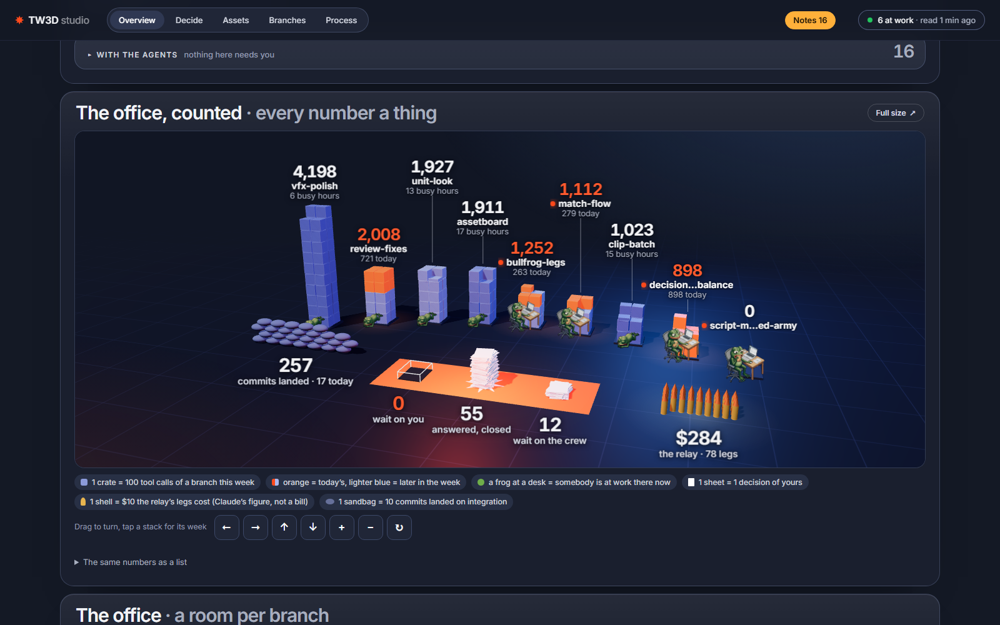
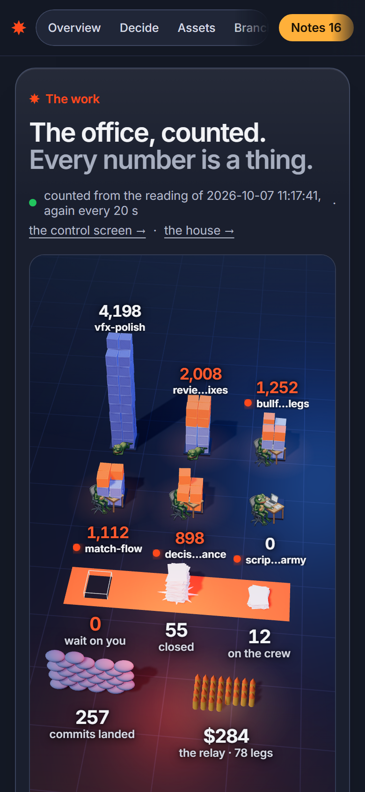
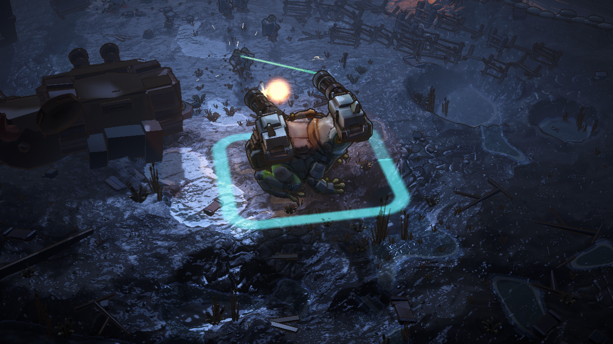
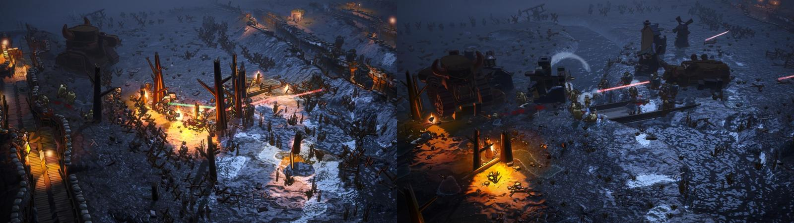
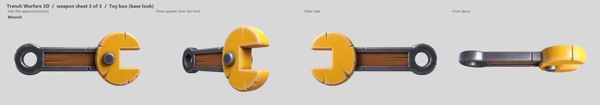
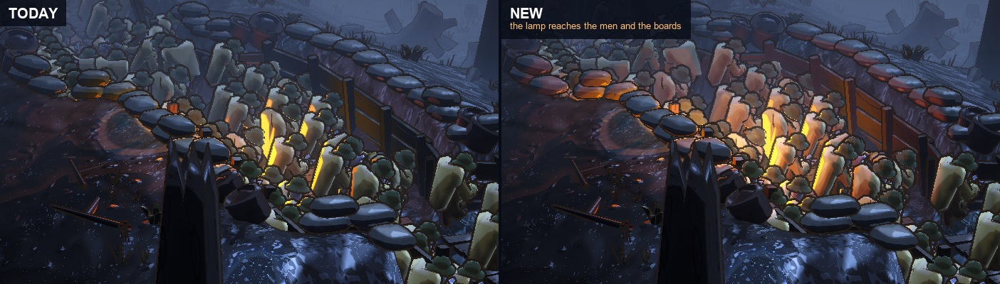
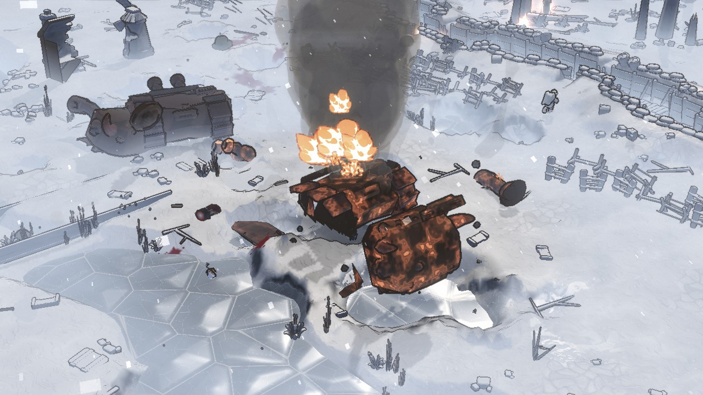

# Goals: what the game is for, and what matters now

**His answer of 2026-10-08: pictures and films before the words, and things to click.** Expanded that day from his "can you expand it?". The rows of [decisions.md](decisions.md) win wherever this page and a row disagree. This page gathers what is already written down; it decides nothing. The ideas agent (the skill tw-ideas)
reads it first, and an idea names the goal it serves. When a row of decisions.md changes a goal, change the line
here in the same commit.

Every line names its source: the date of a row of decisions.md, or a doc. **Not landed** beside a date means the row
is his and is pushed, but sits on a lane that has not landed (the decision lane of 2026-10-07, or the relay's lane)
and is not in decisions.md on this branch yet. Such a line is newer than the rest; check it when its row lands.

## Pictures and films

Each goal is a picture or a film first. Click it and the page goes to that goal's sources. The ideas agent reads the sourced lines further down. This page still decides nothing.

The control room, counted. [Its sources](#goal-control-room).

The way the work is counted. [Its sources](#goal-way-we-work).

Frogs first: the Bullfrog in a battle. [Its sources](#goal-frogs).

A match on the field. The ones that end should split about evenly. [Its sources](#goal-matches).

A weapon, drawn before it is built. [Its sources](#goal-units).

The night: the lamp reaches the men. [Its sources](#goal-night).

A wreck on fire. [The film of a Bullfrog going down](goals/bullfrog-down.mp4). [Its sources](#goal-deaths).

## What the game is

- A 3D remake of the 2D tug-of-war RTS Trench Warfare 1917 that keeps its identity: attrition along one axis,
  deployment slots, trench commands, off-map support fire, silver per second. ([overview](../00-overview.md), Vision.)
- The core loop is the trench fight: garrison, fire step, suppression and pinning, advance and fall back, barrage
  with craters, gas that sinks into trenches. ([plan review](../11-plan-review.md), section 4.)
- **How a match plays.** Reinforcements ride the boats in; nobody pops up on the field. (2026-09-22.) Men are
  deployed across the whole width, spread over the map and go out of their way to attack each other; inside 8 m
  they close in and fight hand to hand. (Rows of 2026-09-28.) Under fire they go forward in rushes: "let's make it
  as realistic as possible". (2026-10-01.) The trench always stands and always gives limited protection. (2026-09-24.)
- **How a match ends.** A side wins when it holds every objective; an objective changes hands when enough infantry
  hold it. ([tasks.md](tasks.md), Objectives, money, victory, the debrief.) Machines drive to the enemy HQ and wait
  there while the infantry take it. (2026-10-01.)
- **The fun is in how units die.** "lots of the fun arrives as units die, we need to make this more absurd":
  slapstick and gore, cartoon physics. (2026-09-28.) On by default since 2026-09-30.
- **The look is a painted cartoon mudfield at night.** Night is the default. (2026-09-21.) Every light is warm and
  blue is only moonlight; comic sound words stay, rarely; Dust Front is a craft reference, not a style to copy.
  (Rows of 2026-09-29.)
- **Everything is built for the standard view**: pitch 25, zoom 30, turned 21 degrees toward the enemy. (2026-09-21.)
- **Machines are gigantic and men are small**: infantry are 25 % shorter, and doors, crates, guns and houses are
  true to the soldier. (2026-09-23, 2026-09-26.) Nothing on the field is ruled or evenly spread. (2026-09-21.)
  Coast and snow levels are the focus, coast first. (2026-09-23.)
- **The factions.** The game's code holds six, each with ten slots: Iron and Brass and four historical armies.
  ([tasks.md](tasks.md), Factions, rosters and the unit table.) Brass alone drops paratroopers; the six support
  cards are shared until the roster is redesigned. (2026-09-27, 2026-10-06.)
- **The frog faction is the main faction.** Its models are the Brute, the Croaker, the Hopper, the Mercy, the Frog
  and the Cutter. (2026-10-06.) The first five are battle units of the test level, in no faction's pool. (2026-09-28.)
- **It is watched, not read**: a picture or a film first, words second. (2026-10-03, and the taste below.)

## What matters now (newest first)

Each goal has a short name; an idea says in its why now which one it serves. "Better" is in his words, or a number
a row gives. "Open" is what the rows had left open on their date. The kinds are those of the ideas tool.

1. **The control room.** "we need to start landing and merging some of the controlroom index ideas, we have idea
   agent we need to implemenet and updated data visualization". (2026-10-08.)
   - Better: "i want more things to be clickable, once i click it should bring me to the relevant asset or have me
     be able to leave notes the agents can read"; "Be as visual as you can", "slick and overseeable". (2026-10-06.)
   - Open: "track down if there is more work to implement and intergrate. fix the merge bugs after". (2026-10-08.)
     Nothing wakes the master, and nothing puts an accepted idea on the board by itself. (Rows of 2026-10-07.)
   - Serves it: something on the board he can see, click or answer. Kind: interface or tool.

2. **The way we work.** The board lists what agents left unfinished, "so we dont lose track of unfinished tasks and
   can spawn an agent". (2026-10-07.)
   - Better: the process critique of 2026-10-04 gave the way of working 31 of 100. Two of its three fixes were
     taken; one re-score follows "once the two fixes are in", and had not been run. (2026-10-04, 2026-10-06.)
   - Not landed, 2026-10-07: the six top review fixes run first, then he looks at what changed.
   - Serves it: a tool or a check that saves his time, or keeps work from getting lost. Kind: tool.

3. **Frogs first.** The frog faction's models are to be "the most important and instantly playable models in the
   game currently". (2026-10-06.) "i want to be able to play with all the new models intergrate them". (2026-09-30.)
   - Better: "instantly playable". Today no faction fields them; the sandbox and the test level do. (2026-09-28.)
   - Open: what each model does in the faction, and what "instantly playable" needs first. (Open list, 2026-10-06.)
   - Not landed, 2026-10-07: "full jobs first (the Hopper truly flies, frog gunners and medics), then make the
     faction pickable". The faction is called Frogs. Its ten cards: rifleman, assault, gunner, medic, sniper, Brute,
     Croaker, Bullfrog, Hopper, Mercy. The Hopper "Flies over everything, never lands". The Mercy carries up to
     four badly hurt men out of view, and they come back at full health. Roster v3 waits until the frogs are playable.
   - Serves it: a job, a look or an effect for one frog unit. Kind: unit, mechanic or look.

4. **Matches that end.** "Factions first: of matches that end, each side wins 40 to 60 %". (2026-10-06.)
   - Better: each faction inside that band. Time to breach and trench keeping are reported, not judged. (2026-10-06.)
   - Where it stood: on six seeds of the scripts' own match, five stalemates and one win. (2026-10-01.) Brass beat
     Iron in 7 of the 8 matches that ended. ([tasks.md](tasks.md), The enemy.)
   - Open: what replaces dead ground, which he removed: "we must think about how we can prevent this in the future
     in a better way: the man werent able to enter the trench." (Open list, 2026-10-06.)
   - Not landed, 2026-10-07: "Find out first why matches do not end, above all Iron's; report with numbers. Bands
     after that". The report: a match with no winner is one where nobody attacks. Then: "Fix the measuring first".
     No unit's number is tuned before the matches are measured again.
   - Serves it: a rule that makes a side attack, or that shows why it does not. Kind: mechanic.

5. **Units that look their part.** "each class unit has a different vfx specific to that class. Think of grenades.
   Laser weapons. Mortars." "Make sure that as much as possible each unit has a 3d model". (Rows of 2026-09-28.)
   - Better: the most common effects first; small arms are about 99 % of the events drawn. (2026-09-28.)
   - Open: every infantryman carries the same rifle: "no still needs a weapon, do some weapon concept ideas".
     Concepts first, nothing built before he has picked. (2026-10-06.)
   - Not landed: two weapon looks are kept, toy box and brass and walnut, "it could be an upgrade". (2026-10-07.)
     "lets improve the units visuals, vfx, animation etc. you have 5 %" of the week. (2026-10-06.)
   - Serves it: a look, an effect or a move that tells one unit from the next. Kind: unit or look.

6. **The night.** The night look is his two edits of a game screenshot, the palette of one and the effects of the
   other; of its first part, on the captures, he said "its good". (Rows of 2026-09-29.)
   - Better: keep the blue night, lift the distance into lighter layered fog, spend the highlights on warm fire:
     warm-lit 2 to 5 % where ours had 0.14 %. No stray blue or purple sparkles. (2026-09-29.)
   - Open: the second part (flames streaking on wet mud, orange glints, dark props against the haze, softer pools)
     was never shown to him. (Open list, 2026-10-06.)
   - Not landed, 2026-10-07: "it should allways be today": today's night stays, the second part does not land.
     "lets use less lights and instead try to simulate them or bake them": the 8 lamps nearest the view stay real.
   - Serves it: warm light and shapes that read, inside today's night and with no more real lights. Kind: look.

7. **Absurd deaths.** "lots of the fun arrives as units die, we need to make this more absurd"; "we need blood".
   (Rows of 2026-09-28.) "turn it on and let me test it". (2026-09-30.)
   - Better: big arcs, flips, bounces and skids, pancakes under tracks, helmets popping off, more dismemberment and
     blood. The knob has one step past the one in use, called ludicrous. (2026-09-28.)
   - Limits: launched bodies, no ragdolls (2026-09-26); break-apart parts only, no new bake (2026-09-28).
   - Serves it: a new way for one kind of unit to die, that he can watch. Kind: look or unit.

## His taste, as patterns across rows

He keeps saying yes to:

- **Pictures and films before words.** "i dont have to see this wall of text on a page, im more intrested in visual
  changes". (2026-10-03.) A decision comes with "any visual evidence". (2026-10-06.)
- **Things to click and act on.** "i want more things to be clickable". (2026-10-06.)
- **The absurd.** Slapstick deaths, crabs that pounce (rows of 2026-09-28), a house of walking frogs (2026-10-05).
- **Every unit different.** Its own effects, its own model, its own way to fight up close. (Rows of 2026-09-28.)
- **Warm light, lean effects.** "its good" of the warm night. (2026-09-29.) "make the smoke in game less heavy",
  "small lean smoke plumes", "the fire needs more fidelity". (2026-09-28.)
- **Polish and motion.** "add slight animations like a motion designer would". (2026-10-06.) Not landed,
  2026-10-07: "i need you to be even more creative and use differnt tools to impress".
- **Trying it in play.** "turn it on and let me test it" (2026-09-30); "judge them in play" (2026-10-06).

He keeps saying no to (the full list is in the context of the ideas tool; these are the patterns in it):

- **Chaos the player cannot read.** No constant bombardment: "it adds too much unknown and chaos; we might add it
  back later with an ability". (2026-09-28.) The fleet's guns stay silent unless switched on. (2026-10-06.)
- **Fights from across the map.** "not good, reduce range" (2026-10-01); every reach cut by 20 % (2026-09-28).
- **Crowds that move as one.** Men in rows on set paths (2026-09-28); machines that "clump together" (2026-10-06).
- **Physics for its own sake.** Launched bodies, not ragdolls (2026-09-26); no trench cave-in (2026-09-24).
- **Rows that lead nowhere, and being asked twice.** "i have no clue what to pick or what needs me". (2026-10-06.)
- **Reopening what he called fine.** "that's fine" (2026-10-01); "Keep 300 triangles", "Leave it" (2026-10-06).
- **New frameworks and new art pipelines.** The board stays the orchestration (2026-10-04); the Dust Front lessons
  come with no re-art and no new art pipeline (2026-09-29).

## Hard limits

- Windows x64 only. 3,000 units at most. Two developers. Online stays possible. (Rows of 2026-09-20.)
- Same-build determinism (2026-09-20): the same seed and commands give every peer the same world, on a fixed 20 Hz
  tick, with no clock, no engine random numbers and no physics in the sim. ([rules](../03-determinism-rules.md).)
- Speed: 60 fps at 1080p on a GTX 1050 or Intel Iris Xe. ([overview](../00-overview.md), Hard constraints.)
- Sim and show are two lanes; work that needs both is split, the sim part first. A change to the sim's state takes
  a new replay version ([working agreement](../../CLAUDE.md), Lanes and The seam), and older replays stop loading
  (2026-10-06, hand to hand).
- Unit art: a full model 1,200 to 1,500 vertices, a far model 250 to 400, a vehicle 3,000 to 5,000. (2026-09-21.)
- **Concepts first**: an effect, an animation or a character starts with concepts or references he picks from;
  nothing of it is built before he has picked. A fix that changes no look needs none. (Rows of 2026-10-06.)
- **A lane lands only on his word.** Four may land without asking once their checks are green: the decision rows,
  the test modules, the verification lanes, the asset board. (2026-10-04.) Not landed, 2026-10-07: finished work
  lands "as soon as its full test run is green"; what changes how a battle looks or plays still goes to him first.

## How he works with agents

- **A decision comes as a brief**: what it is for in 45 words at most, two to four options with the writer's first
  and why, and the pictures or films that bear on it. "a really short to the point report". (2026-10-06.)
- **His answer on the Decide page is the decision**, and it queues its work with no second yes: "lets go". He is
  asked again only when his words do not say what to build. (Rows of 2026-10-06.)
- **"Needs you" is his open decisions only.** A row of his never leads to a branch page. (2026-10-06.)
- **Each step an asset goes through is put to him**, with "captures that make it easy to approve"; effects,
  animations and characters start with concepts he picks from (Hard limits). (Rows of 2026-10-06.)
- **An idea is a card with a picture.** "we dont do every tasks, the user chooses"; three at a time when he asks
  for more; never "things already tried or rejected". (2026-10-07.) A title of 10 words, a pitch of 35, a why now
  of 30, one to three pictures; he answers Do it, Not now or Never. ([pipelines.md](pipelines.md), the ideas row.)
- **His yes to an idea is a yes to the route its card showed.** "Keep moving around me": the steps that do not
  need his pick go on while a decision waits. (2026-10-07.)
- **The day's budget holds.** Queued work runs in his order within the day's budget, and no unit starts that the
  budget does not cover. (2026-10-06.) The board starts at most eight ideas runs a day, three of them unasked, one
  at a time, each cut off after 30 minutes. (2026-10-07.) Not landed, 2026-10-07: "Our budget per day for all
  agents in the project is now 11 percent or unless otherwise specified", of the plan's weekly limit.

## What this page does not decide

- Anything on the open list of decisions.md stays open and is his to answer: what replaces dead ground, what each
  frog model does, the second part of the night look, the six rules for how men spread out, and the rest of it.
- It sets no order of work. The goals are in the order of their newest row; what runs first is his queue.
- Where this page and a row of decisions.md disagree, the row wins: fix the page in the same commit.
